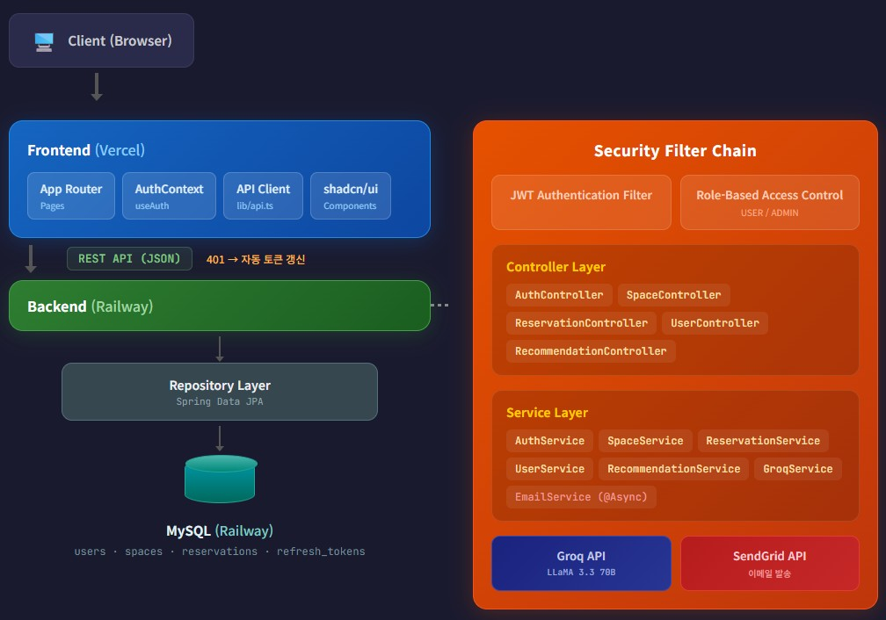
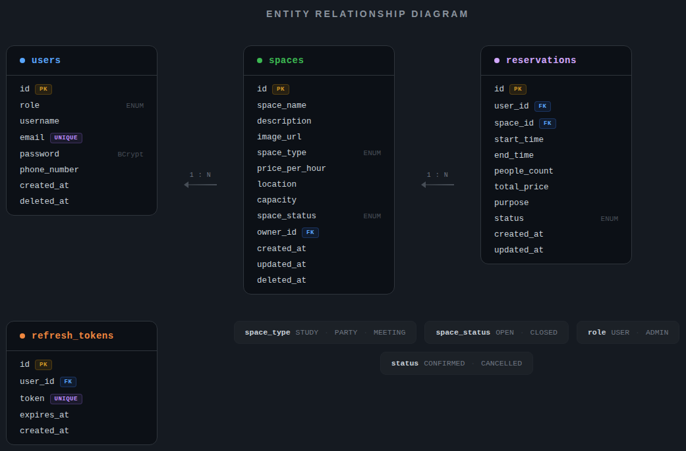

# SpaceBook

AI 기반 공간 예약 플랫폼

> AI 기반으로 원하는 공간을 추천받고, 실시간 예약까지 한 번에 가능한 공간 예약 플랫폼입니다.

<br>

## 🔗 배포 링크

| 서비스 | URL |
|--------|-----|
| 프론트엔드 | https://spacebook-five.vercel.app |
| 백엔드 API | https://spacebook-production.up.railway.app |
| API 문서 (Swagger) | https://spacebook-production.up.railway.app/swagger-ui.html |

<br>

## 🛠 기술 스택

### Backend


### Frontend


### 🔐 Authentication


### 🗄 Database


### 🤖 AI / External API


### 🚀 Deploy


### 🧪 Test & Docs


### 🔧 Tools


<br>

## 🏗 아키텍처



<details>
<summary>아키텍처 텍스트</summary>

```
┌─────────────────────────────────────────────────────────────────────┐
│                          Client (Browser)                           │
└────────────────────────────────┬────────────────────────────────────┘
                                 │
                                 ▼
┌─────────────────────────────────────────────────────────────────────┐
│                     Frontend (Vercel)                               │
│  ┌───────────┐  ┌───────────┐  ┌──────────────┐  ┌──────────────┐   │
│  │ App Router│  │AuthContext│  │  API Client  │  │  shadcn/ui   │   │
│  │ (Pages)   │  │ (useAuth) │  │ (lib/api.ts) │  │  Components  │   │
│  └───────────┘  └───────────┘  └──────┬───────┘  └──────────────┘   │
│                                       │ 401 → 자동 토큰 갱신         │
└───────────────────────────────────────┼─────────────────────────────┘
                                        │ REST API (JSON)
                                        ▼
┌─────────────────────────────────────────────────────────────────────┐
│                     Backend (Railway)                               │
│                                                                     │
│  ┌─────────────────────────────────────────────────────────────┐    │
│  │                    Security Filter Chain                    │    │
│  │  ┌─────────────────────┐  ┌──────────────────────────────┐  │    │
│  │  │ JwtAuthentication   │  │ Role-based Access Control    │  │    │
│  │  │ Filter              │  │ (USER / ADMIN)               │  │    │
│  │  └─────────────────────┘  └──────────────────────────────┘  │    │
│  └─────────────────────────────────────────────────────────────┘    │
│                              │                                      │
│                              ▼                                      │
│  ┌─────────────────────────────────────────────────────────────┐    │
│  │                      Controller Layer                       │    │
│  │  AuthController · SpaceController · ReservationController   │    │
│  │  UserController · RecommendationController                  │    │
│  └──────────────────────────┬──────────────────────────────────┘    │
│                              │ @Valid / @Validated (형식 검증)       │
│                              ▼                                      │
│  ┌─────────────────────────────────────────────────────────────┐    │
│  │                       Service Layer                         │    │
│  │  AuthService · SpaceService · ReservationService            │    │
│  │  UserService · RecommendationService · GroqService          │    │
│  │  EmailService (@Async)                                      │    │
│  └───────┬──────────────────────────────────────┬──────────────┘    │
│          │ 비즈니스 규칙 검증                       │                 │
│          ▼                                       ▼                  │
│  ┌────────────────────┐    ┌──────────────────────┐  ┌────────────┐ │
│  │  Repository Layer  │    │   Groq API (외부)    │  │SendGrid API│ │
│  │  (Spring Data JPA) │    │   LLaMA 3.3 70B      │  │   (메일)   │ │
│  └────────┬───────────┘    └──────────────────────┘  └────────────┘ │
│           │                                                         │
└───────────┼─────────────────────────────────────────────────────────┘
            │
            ▼
┌─────────────────────┐
│   MySQL (Railway)   │
│  users · spaces     │
│  reservations       │
│  refresh_tokens     │
└─────────────────────┘
```

</details>

<br>

## 📁 프로젝트 구조

```
spacebook/
├── backend/                          # Spring Boot
│   └── src/main/java/com/kjh/spacebook/
│       ├── common/
│       │   ├── config/               # Security, OpenAPI, RestTemplate, PasswordEncoder
│       │   ├── exception/            # GlobalExceptionHandler, ErrorCode, BusinessException
│       │   ├── response/             # ApiResponse 공통 응답 래퍼
│       │   ├── service/              # EmailService (이메일 알림)
│       │   └── security/jwt/         # JwtUtil, JwtAuthenticationFilter, JwtProperties
│       └── domain/
│           ├── auth/                 # 회원가입, 로그인, 로그아웃, 탈퇴, 토큰 재발급
│           ├── space/                # 공간 CRUD, 검색/필터/정렬
│           ├── reservation/          # 예약 생성, 조회, 취소
│           ├── user/                 # 내 정보 조회/수정
│           └── recommendation/       # AI 자연어 공간 추천
│
└── frontend/                         # Next.js
    └── src/
        ├── app/                      # 페이지 (App Router)
        │   ├── login/, signup/       # 인증 페이지
        │   ├── spaces/[id]/          # 공간 상세, 예약 페이지
        │   ├── reservations/[id]/    # 예약 상세
        │   └── mypage/               # 마이페이지, 정보 수정
        ├── components/               # 공통 컴포넌트 (Header, Footer, SpaceCard, shadcn/ui)
        ├── hooks/                    # AuthContext, useAuth
        ├── lib/                      # API 클라이언트 (토큰 자동 갱신)
        └── types/                    # TypeScript 인터페이스
```

<br>

## ✨ 주요 기능

### 1. 인증/인가

- JWT 기반 Stateless 인증 (Access Token 30분 / Refresh Token 1일)
- Refresh Token Rotation 방식 재발급 — 탈취 시 자동 무효화
- 프론트엔드 401 응답 시 자동 토큰 갱신 후 요청 재시도
- 회원 탈퇴 시 Soft Delete + 이메일 suffix 처리로 재가입 허용
- 회원 탈퇴 시 확정된 예약(CONFIRMED)이 존재하면 탈퇴 불가
- 역할 기반 접근 제어 (USER / ADMIN)

### 2. 공간 관리

- ADMIN 전용 공간 CRUD (생성, 수정, Soft Delete)
- 다중 조건 검색: 지역(텍스트 입력), 공간 유형(뱃지 클릭 필터)
- 정렬: 최신순(기본) / 가격 낮은순 / 가격 높은순
- 페이지네이션 (Spring Data Pageable)

### 3. 예약 시스템

- 시간 단위 예약 (정시 기준)
- 예약 시간 중복 검증 — 비관적 락(Pessimistic Lock)으로 동시성 제어
- 현재 시간대 예약 차단 (이미 시작된 시간대는 예약 불가)
- 날짜별 예약된 시간대 조회 API → 프론트엔드에서 시각적 표시
- 예약 취소 (시작 1일 전까지)
- 총 가격 자동 계산 (시간 × 시간당 가격)
- 예약 생성/취소 시 이메일 알림 발송 (SendGrid HTTP API, `@Async` 비동기 처리)

### 4. AI 공간 추천

- 자연어 입력 → Groq LLM이 검색 조건 추출 → JSON 형태로 반환 → DB 검색 → 결과 반환
- 예: *"강남에서 10명이 파티할 수 있는 곳"* → `location=강남, capacity=10, spaceType=PARTY`
- 추출 조건: `location`(지역), `capacity`(인원), `spaceType`(공간 유형) — 3개 중 NULL 값이 있어도 나머지 조건으로 검색 가능
- Groq API (LLaMA 3.3 70B, temperature=0) 사용

### 5. 내 정보 관리

- 프로필 조회 / 전화번호 변경 / 비밀번호 변경
- 비밀번호 변경 시 기존 비밀번호 확인 후 변경 가능
- PATCH 부분 수정 — null 필드는 기존 값 유지

<br>

## 📡 API 엔드포인트

### 공통 응답 형식

모든 API는 `ApiResponse<T>` 래퍼로 응답합니다. `@JsonInclude(NON_NULL)` 적용으로 null 필드는 응답에서 제외됩니다.

**성공 (데이터 반환)**

```json
{
  "success": true,
  "data": { ... },
  "timestamp": "2026-02-27T10:00:00"
}
```

**성공 (처리 완료)**

```json
{
  "success": true,
  "message": "예약이 취소되었습니다.",
  "timestamp": "2026-02-27T10:00:00"
}
```

**실패**

```json
{
  "success": false,
  "message": "에러 메시지",
  "timestamp": "2026-02-27T10:00:00"
}
```

---

### Auth

| Method | Endpoint | 인증 | 설명 |
|--------|----------|------|------|
| POST | `/api/v1/auth/signup` | - | 회원가입 |
| POST | `/api/v1/auth/login` | - | 로그인 |
| POST | `/api/v1/auth/logout` | O | 로그아웃 |
| POST | `/api/v1/auth/reissue` | - | 토큰 재발급 |
| DELETE | `/api/v1/auth/withdraw` | O | 회원 탈퇴 |

<details>
<summary>🔐 Auth API 상세</summary>

#### 회원가입

```
POST /api/v1/auth/signup
Content-Type: application/json
```

| 파라미터 | 타입 | 필수 | 설명 |
|----------|------|------|------|
| username | String | Y | 사용자 이름 |
| email | String | Y | 이메일 (형식: xxx@xxx.xx) |
| password | String | Y | 비밀번호 (8자 이상, 영문+숫자+특수문자 포함) |
| phoneNumber | String | Y | 전화번호 (형식: 010-XXXX-XXXX) |

**응답**

`201 Created`

```json
{
  "success": true,
  "data": {
    "accessToken": "eyJ...",
    "refreshToken": "eyJ..."
  },
  "timestamp": "2026-02-27T10:00:00"
}
```

`400 Bad Request` — 형식 오류

```json
{
  "success": false,
  "message": "올바른 이메일 형식이 아닙니다.",
  "timestamp": "2026-02-27T10:00:00"
}
```

`409 Conflict` — 이메일 중복

```json
{
  "success": false,
  "message": "이미 사용 중인 이메일입니다.",
  "timestamp": "2026-02-27T10:00:00"
}
```

---

#### 로그인

```
POST /api/v1/auth/login
Content-Type: application/json
```

| 파라미터 | 타입 | 필수 | 설명 |
|----------|------|------|------|
| email | String | Y | 이메일 |
| password | String | Y | 비밀번호 |

**응답**

`200 OK`

```json
{
  "success": true,
  "data": {
    "accessToken": "eyJ...",
    "refreshToken": "eyJ..."
  },
  "timestamp": "2026-02-27T10:00:00"
}
```

`401 Unauthorized` — 인증 실패

```json
{
  "success": false,
  "message": "이메일 또는 비밀번호가 올바르지 않습니다.",
  "timestamp": "2026-02-27T10:00:00"
}
```

`410 Gone` — 탈퇴 계정

```json
{
  "success": false,
  "message": "탈퇴한 계정입니다.",
  "timestamp": "2026-02-27T10:00:00"
}
```

---

#### 로그아웃

```
POST /api/v1/auth/logout
Authorization: Bearer {accessToken}
```

**응답**

`200 OK`

```json
{
  "success": true,
  "timestamp": "2026-02-27T10:00:00"
}
```

`401 Unauthorized`

```json
{
  "success": false,
  "message": "로그인 후 진행해주세요.",
  "timestamp": "2026-02-27T10:00:00"
}
```

---

#### 토큰 재발급

```
POST /api/v1/auth/reissue
Content-Type: application/json
```

| 파라미터 | 타입 | 필수 | 설명 |
|----------|------|------|------|
| refreshToken | String | Y | 리프레시 토큰 |

**응답**

`200 OK`

```json
{
  "success": true,
  "data": {
    "accessToken": "eyJ...",
    "refreshToken": "eyJ..."
  },
  "timestamp": "2026-02-27T10:00:00"
}
```

`401 Unauthorized` — 유효하지 않은 토큰

```json
{
  "success": false,
  "message": "유효하지 않은 리프레시 토큰입니다.",
  "timestamp": "2026-02-27T10:00:00"
}
```

`401 Unauthorized` — 만료된 토큰

```json
{
  "success": false,
  "message": "만료된 리프레시 토큰입니다.",
  "timestamp": "2026-02-27T10:00:00"
}
```

`401 Unauthorized` — 폐기된 토큰

```json
{
  "success": false,
  "message": "폐기된 리프레시 토큰입니다.",
  "timestamp": "2026-02-27T10:00:00"
}
```

---

#### 회원 탈퇴

```
DELETE /api/v1/auth/withdraw
Authorization: Bearer {accessToken}
Content-Type: application/json
```

| 파라미터 | 타입 | 필수 | 설명 |
|----------|------|------|------|
| password | String | Y | 현재 비밀번호 (확인용) |

**응답**

`200 OK`

```json
{
  "success": true,
  "timestamp": "2026-02-27T10:00:00"
}
```

`400 Bad Request` — 비밀번호 불일치

```json
{
  "success": false,
  "message": "비밀번호가 일치하지 않습니다.",
  "timestamp": "2026-02-27T10:00:00"
}
```

`409 Conflict` — 확정 예약 존재

```json
{
  "success": false,
  "message": "확정된 예약이 존재하여 탈퇴할 수 없습니다.",
  "timestamp": "2026-02-27T10:00:00"
}
```

</details>

---

### Space

| Method | Endpoint | 인증 | 설명 |
|--------|----------|------|------|
| GET | `/api/v1/spaces` | - | 공간 목록 (검색/필터/정렬/페이지네이션) |
| GET | `/api/v1/spaces/{id}` | - | 공간 상세 |
| GET | `/api/v1/spaces/{id}/reserved-times?date=` | - | 예약된 시간대 조회 |
| GET | `/api/v1/spaces/me` | ADMIN | 내 공간 목록 |
| POST | `/api/v1/spaces` | ADMIN | 공간 등록 |
| PATCH | `/api/v1/spaces/{id}` | ADMIN | 공간 수정 |
| DELETE | `/api/v1/spaces/{id}` | ADMIN | 공간 삭제 |

<details>
<summary>📍 Space API 상세</summary>

#### 공간 목록 조회

```
GET /api/v1/spaces?location=강남&spaceType=STUDY&sort=pricePerHour,asc&page=0&size=10
```

| 파라미터 | 타입 | 필수 | 설명 |
|----------|------|------|------|
| location | String | N | 위치 검색어 (예: "강남") |
| spaceType | String | N | 공간 유형 (STUDY / PARTY / MEETING) |
| minPrice | Integer | N | 최소 가격 (0 이상) |
| maxPrice | Integer | N | 최대 가격 (0 이상) |
| page | Integer | N | 페이지 번호 (기본: 0) |
| size | Integer | N | 페이지 크기 (기본: 10) |
| sort | String | N | 정렬 (기본: createdAt,desc) |

**응답**

`200 OK`

```json
{
  "success": true,
  "data": {
    "content": [
      {
        "id": 1,
        "spaceName": "스터디카페 A",
        "spaceType": "STUDY",
        "capacity": 10,
        "location": "강남",
        "pricePerHour": 5000,
        "imageUrl": "https://..."
      }
    ],
    "totalElements": 1,
    "totalPages": 1,
    "number": 0,
    "size": 10
  },
  "timestamp": "2026-02-27T10:00:00"
}
```

`400 Bad Request` — 가격 범위 오류

```json
{
  "success": false,
  "message": "최소 가격이 최대 가격보다 클 수 없습니다.",
  "timestamp": "2026-02-27T10:00:00"
}
```

---

#### 공간 상세 조회

```
GET /api/v1/spaces/1
```

**응답**

`200 OK`

```json
{
  "success": true,
  "data": {
    "id": 1,
    "spaceName": "스터디카페 A",
    "description": "조용한 스터디 공간입니다.",
    "imageUrl": "https://...",
    "spaceType": "STUDY",
    "pricePerHour": 5000,
    "location": "강남",
    "capacity": 10,
    "spaceStatus": "OPEN",
    "ownerId": 1,
    "createdAt": "2026-02-27T10:00:00",
    "updatedAt": "2026-02-27T10:00:00"
  },
  "timestamp": "2026-02-27T10:00:00"
}
```

`404 Not Found`

```json
{
  "success": false,
  "message": "공간을 찾을 수 없습니다.",
  "timestamp": "2026-02-27T10:00:00"
}
```

---

#### 예약된 시간대 조회

```
GET /api/v1/spaces/1/reserved-times?date=2026-03-01
```

| 파라미터 | 타입 | 필수 | 설명 |
|----------|------|------|------|
| date | String | Y | 조회할 날짜 (yyyy-MM-dd) |

**응답**

`200 OK`

```json
{
  "success": true,
  "data": [
    { "startHour": 10, "endHour": 12 },
    { "startHour": 14, "endHour": 16 }
  ],
  "timestamp": "2026-02-27T10:00:00"
}
```

---

#### 공간 등록

```
POST /api/v1/spaces
Authorization: Bearer {accessToken}
Content-Type: application/json
```

| 파라미터 | 타입 | 필수 | 설명 |
|----------|------|------|------|
| spaceName | String | Y | 공간 이름 |
| description | String | Y | 공간 설명 |
| imageUrl | String | Y | 이미지 URL |
| spaceType | String | Y | 공간 유형 (STUDY / PARTY / MEETING) |
| pricePerHour | Integer | Y | 시간당 가격 (0보다 큼) |
| location | String | Y | 위치 |
| capacity | Integer | Y | 수용 인원 (0보다 큼) |

**응답**

`201 Created`

```json
{
  "success": true,
  "data": {
    "id": 1,
    "spaceName": "스터디카페 A",
    "description": "조용한 스터디 공간입니다.",
    "imageUrl": "https://...",
    "spaceType": "STUDY",
    "pricePerHour": 5000,
    "location": "서울 강남구",
    "capacity": 10,
    "spaceStatus": "OPEN",
    "ownerId": 1,
    "createdAt": "2026-02-27T10:00:00",
    "updatedAt": "2026-02-27T10:00:00"
  },
  "timestamp": "2026-02-27T10:00:00"
}
```

`400 Bad Request` — 형식 오류

```json
{
  "success": false,
  "message": "공간 이름은 필수입니다.",
  "timestamp": "2026-02-27T10:00:00"
}
```

`403 Forbidden` — 권한 없음

```json
{
  "success": false,
  "message": "해당 리소스에 접근할 권한이 없습니다.",
  "timestamp": "2026-02-27T10:00:00"
}
```

---

#### 공간 수정

```
PATCH /api/v1/spaces/1
Authorization: Bearer {accessToken}
Content-Type: application/json
```

| 파라미터 | 타입 | 필수 | 설명 |
|----------|------|------|------|
| spaceName | String | N | 공간 이름 |
| description | String | N | 공간 설명 |
| imageUrl | String | N | 이미지 URL |
| spaceType | String | N | 공간 유형 (STUDY / PARTY / MEETING) |
| pricePerHour | Integer | N | 시간당 가격 (0보다 큼) |
| location | String | N | 위치 |
| capacity | Integer | N | 수용 인원 (0보다 큼) |
| spaceStatus | String | N | 공간 상태 (OPEN / CLOSED) |

> 모든 필드 선택사항 — null이면 기존 값 유지

**응답**

`200 OK`

```json
{
  "success": true,
  "data": {
    "id": 1,
    "spaceName": "스터디카페 A",
    "pricePerHour": 6000,
    "spaceStatus": "CLOSED",
    "...": "..."
  },
  "timestamp": "2026-02-27T10:00:00"
}
```

`404 Not Found`

```json
{
  "success": false,
  "message": "공간을 찾을 수 없습니다.",
  "timestamp": "2026-02-27T10:00:00"
}
```

---

#### 공간 삭제

```
DELETE /api/v1/spaces/1
Authorization: Bearer {accessToken}
```

**응답**

`200 OK`

```json
{
  "success": true,
  "timestamp": "2026-02-27T10:00:00"
}
```

`404 Not Found`

```json
{
  "success": false,
  "message": "공간을 찾을 수 없습니다.",
  "timestamp": "2026-02-27T10:00:00"
}
```

</details>

---

### Reservation

| Method | Endpoint | 인증 | 설명 |
|--------|----------|------|------|
| POST | `/api/v1/reservations` | O | 예약 생성 |
| GET | `/api/v1/reservations/my` | O | 내 예약 목록 |
| GET | `/api/v1/reservations/{id}` | O | 예약 상세 |
| PATCH | `/api/v1/reservations/{id}/cancel` | O | 예약 취소 |

<details>
<summary>📅 Reservation API 상세</summary>

#### 예약 생성

```
POST /api/v1/reservations
Authorization: Bearer {accessToken}
Content-Type: application/json
```

| 파라미터 | 타입 | 필수 | 설명 |
|----------|------|------|------|
| spaceId | Long | Y | 공간 ID |
| startTime | String | Y | 시작 시간 (yyyy-MM-ddTHH:00:00, 정시만 가능) |
| endTime | String | Y | 종료 시간 (yyyy-MM-ddTHH:00:00, 정시만 가능) |
| peopleCount | Integer | Y | 인원 수 (0보다 큼, 공간 수용 인원 이하) |
| purpose | String | N | 예약 목적 |

**응답**

`201 Created`

```json
{
  "success": true,
  "data": {
    "id": 1,
    "spaceId": 1,
    "spaceName": "스터디카페 A",
    "startTime": "2026-03-01T10:00:00",
    "endTime": "2026-03-01T12:00:00",
    "peopleCount": 5,
    "totalPrice": 10000,
    "purpose": "팀 스터디",
    "status": "CONFIRMED",
    "createdAt": "2026-02-27T10:00:00"
  },
  "timestamp": "2026-02-27T10:00:00"
}
```

`400 Bad Request` — 정시 아님

```json
{
  "success": false,
  "message": "예약은 정각 단위로만 가능합니다.",
  "timestamp": "2026-02-27T10:00:00"
}
```

`400 Bad Request` — 시간 역전

```json
{
  "success": false,
  "message": "예약 종료 시간은 시작 시간 이후여야 합니다.",
  "timestamp": "2026-02-27T10:00:00"
}
```

`400 Bad Request` — 과거 시간

```json
{
  "success": false,
  "message": "과거 시간으로는 예약할 수 없습니다.",
  "timestamp": "2026-02-27T10:00:00"
}
```

`400 Bad Request` — 현재 시간대

```json
{
  "success": false,
  "message": "현재 시간대는 예약할 수 없습니다.",
  "timestamp": "2026-02-27T10:00:00"
}
```

`400 Bad Request` — 인원 초과

```json
{
  "success": false,
  "message": "예약 인원이 공간 최대 수용 인원을 초과합니다.",
  "timestamp": "2026-02-27T10:00:00"
}
```

`400 Bad Request` — 공간 닫힘

```json
{
  "success": false,
  "message": "현재 대여가 불가능한 공간입니다.",
  "timestamp": "2026-02-27T10:00:00"
}
```

`409 Conflict` — 시간 중복

```json
{
  "success": false,
  "message": "해당 시간대에 이미 예약이 존재합니다.",
  "timestamp": "2026-02-27T10:00:00"
}
```

---

#### 내 예약 목록 조회

```
GET /api/v1/reservations/my?page=0&size=10
Authorization: Bearer {accessToken}
```

| 파라미터 | 타입 | 필수 | 설명 |
|----------|------|------|------|
| page | Integer | N | 페이지 번호 (기본: 0) |
| size | Integer | N | 페이지 크기 (기본: 10) |

**응답**

`200 OK`

```json
{
  "success": true,
  "data": {
    "content": [
      {
        "id": 1,
        "spaceId": 1,
        "spaceName": "스터디카페 A",
        "startTime": "2026-03-01T10:00:00",
        "endTime": "2026-03-01T12:00:00",
        "status": "CONFIRMED"
      }
    ],
    "totalElements": 1,
    "totalPages": 1,
    "number": 0,
    "size": 10
  },
  "timestamp": "2026-02-27T10:00:00"
}
```

---

#### 예약 상세 조회

```
GET /api/v1/reservations/1
Authorization: Bearer {accessToken}
```

**응답**

`200 OK`

```json
{
  "success": true,
  "data": {
    "id": 1,
    "spaceId": 1,
    "spaceName": "스터디카페 A",
    "userId": 1,
    "startTime": "2026-03-01T10:00:00",
    "endTime": "2026-03-01T12:00:00",
    "peopleCount": 5,
    "totalPrice": 10000,
    "purpose": "팀 스터디",
    "status": "CONFIRMED",
    "createdAt": "2026-02-27T10:00:00"
  },
  "timestamp": "2026-02-27T10:00:00"
}
```

`403 Forbidden` — 타인 예약

```json
{
  "success": false,
  "message": "본인의 예약만 접근할 수 있습니다.",
  "timestamp": "2026-02-27T10:00:00"
}
```

`404 Not Found`

```json
{
  "success": false,
  "message": "예약을 찾을 수 없습니다.",
  "timestamp": "2026-02-27T10:00:00"
}
```

---

#### 예약 취소

```
PATCH /api/v1/reservations/1/cancel
Authorization: Bearer {accessToken}
```

**응답**

`200 OK`

```json
{
  "success": true,
  "message": "예약이 취소되었습니다.",
  "timestamp": "2026-02-27T10:00:00"
}
```

`400 Bad Request` — 이미 취소

```json
{
  "success": false,
  "message": "이미 취소된 예약입니다.",
  "timestamp": "2026-02-27T10:00:00"
}
```

`400 Bad Request` — 기한 초과

```json
{
  "success": false,
  "message": "예약일 하루 전까지만 취소할 수 있습니다.",
  "timestamp": "2026-02-27T10:00:00"
}
```

`403 Forbidden` — 타인 예약

```json
{
  "success": false,
  "message": "본인의 예약만 접근할 수 있습니다.",
  "timestamp": "2026-02-27T10:00:00"
}
```

</details>

---

### User

| Method | Endpoint | 인증 | 설명 |
|--------|----------|------|------|
| GET | `/api/v1/users/me` | O | 내 정보 조회 |
| PATCH | `/api/v1/users/me` | O | 내 정보 수정 |

<details>
<summary>👤 User API 상세</summary>

#### 내 정보 조회

```
GET /api/v1/users/me
Authorization: Bearer {accessToken}
```

**응답**

`200 OK`

```json
{
  "success": true,
  "data": {
    "id": 1,
    "username": "김지훈",
    "email": "test@naver.com",
    "phoneNumber": "010-1234-5678",
    "createdAt": "2026-02-27T10:00:00"
  },
  "timestamp": "2026-02-27T10:00:00"
}
```

---

#### 내 정보 수정

```
PATCH /api/v1/users/me
Authorization: Bearer {accessToken}
Content-Type: application/json
```

| 파라미터 | 타입 | 필수 | 설명 |
|----------|------|------|------|
| phoneNumber | String | N | 전화번호 (형식: 010-XXXX-XXXX) |
| currentPassword | String | N | 현재 비밀번호 (비밀번호 변경 시 필수) |
| newPassword | String | N | 새 비밀번호 (8자 이상, 영문+숫자+특수문자 포함) |

> 모든 필드 선택사항 — null이면 기존 값 유지

**요청 예시 — 전화번호 변경**

```json
{
  "phoneNumber": "010-9999-8888"
}
```

**요청 예시 — 비밀번호 변경**

```json
{
  "currentPassword": "test1234!!",
  "newPassword": "newpass1234!!"
}
```

**응답**

`200 OK`

```json
{
  "success": true,
  "data": {
    "id": 1,
    "username": "김지훈",
    "email": "test@naver.com",
    "phoneNumber": "010-9999-8888",
    "createdAt": "2026-02-27T10:00:00"
  },
  "timestamp": "2026-02-27T10:00:00"
}
```

`400 Bad Request` — 불완전 입력

```json
{
  "success": false,
  "message": "비밀번호 변경 시 현재 비밀번호와 새 비밀번호를 모두 입력해야 합니다.",
  "timestamp": "2026-02-27T10:00:00"
}
```

`400 Bad Request` — 동일 비밀번호

```json
{
  "success": false,
  "message": "새 비밀번호가 현재 비밀번호와 동일합니다.",
  "timestamp": "2026-02-27T10:00:00"
}
```

`400 Bad Request` — 비밀번호 불일치

```json
{
  "success": false,
  "message": "비밀번호가 일치하지 않습니다.",
  "timestamp": "2026-02-27T10:00:00"
}
```

</details>

---

### Recommendation

| Method | Endpoint | 인증 | 설명 |
|--------|----------|------|------|
| POST | `/api/v1/recommendations` | O | AI 공간 추천 |

<details>
<summary>🤖 Recommendation API 상세</summary>

#### AI 공간 추천

```
POST /api/v1/recommendations
Authorization: Bearer {accessToken}
Content-Type: application/json
```

| 파라미터 | 타입 | 필수 | 설명 |
|----------|------|------|------|
| query | String | Y | 자연어 검색어 |

**요청 예시**

```json
{
  "query": "강남에서 10명이 파티할 수 있는 곳"
}
```

**LLM 내부 추출 조건**

| 조건 | 타입 | 설명 | 예시 |
|------|------|------|------|
| location | String \| null | 지역 | "강남" |
| capacity | Integer \| null | 인원 | 10 |
| spaceType | String \| null | 공간 유형 (STUDY / PARTY / MEETING) | "PARTY" |

> 3개 조건 중 null 값이 있어도 나머지 조건만으로 검색 가능

**응답**

`200 OK`

```json
{
  "success": true,
  "data": [
    {
      "id": 1,
      "spaceName": "파티룸 B",
      "spaceType": "PARTY",
      "capacity": 20,
      "location": "강남",
      "pricePerHour": 30000,
      "imageUrl": "https://..."
    }
  ],
  "timestamp": "2026-02-27T10:00:00"
}
```

`400 Bad Request` — 파싱 실패

```json
{
  "success": false,
  "message": "검색 조건을 추출할 수 없습니다. 다시 입력해주세요.",
  "timestamp": "2026-02-27T10:00:00"
}
```

`503 Service Unavailable` — AI 오류

```json
{
  "success": false,
  "message": "AI 서비스에 일시적인 문제가 발생했습니다.",
  "timestamp": "2026-02-27T10:00:00"
}
```

</details>

<br>

## 🗄 ERD



<details>
<summary>ERD 텍스트</summary>

```
┌──────────────────┐       ┌──────────────────┐       ┌──────────────────┐
│      users       │       │      spaces      │       │   reservations   │
├──────────────────┤       ├──────────────────┤       ├──────────────────┤
│ id          (PK) │       │ id          (PK) │       │ id          (PK) │
│ role             │       │ space_name       │       │ user_id     (FK) │
│ username         │  1:N  │ description      │  1:N  │ space_id    (FK) │
│ email (UNIQUE)   │◄──────│ image_url        │◄──────│ start_time       │
│ password (BCrypt)│       │ space_type       │       │ end_time         │
│ phone_number     │       │ price_per_hour   │       │ people_count     │
│ created_at       │       │ location         │       │ total_price      │
│ deleted_at       │       │ capacity         │       │ purpose          │
└──────────────────┘       │ space_status     │       │ status           │
                           │ owner_id    (FK) │       │ created_at       │
┌──────────────────┐       │ created_at       │       │ updated_at       │
│  refresh_tokens  │       │ updated_at       │       └──────────────────┘
├──────────────────┤       │ deleted_at       │
│ id          (PK) │       └──────────────────┘
│ user_id     (FK) │
│ token (UNIQUE)   │       space_type: STUDY | PARTY | MEETING
│ expires_at       │       space_status: OPEN | CLOSED
│ created_at       │       role: USER | ADMIN
└──────────────────┘       status: CONFIRMED | CANCELLED
```

</details>

<br>

## 📐 설계 원칙

| 원칙 | 적용 |
|------|------|
| 도메인 중심 패키징 | 계층(layer)이 아닌 도메인(auth, space, reservation...) 기준으로 패키지 분리 |
| Soft Delete | `deletedAt` 필드로 논리 삭제, 물리 삭제 없음 |
| 정적 팩토리 메서드 | `User.of()`, `Space.of()` 등으로 객체 생성 의도 명확화 |
| 검증 계층 분리 | Controller: 형식 검증 (`@Valid`, `@Min`) / Service: 비즈니스 규칙 검증 |
| ErrorCode 인터페이스 | 도메인별 ErrorCode enum이 공통 인터페이스를 구현 → `GlobalExceptionHandler`에서 일괄 처리 |
| 공통 응답 형식 | 모든 API가 `ApiResponse<T>` 래퍼로 `success`, `data`, `message`, `timestamp` 반환 |
| 읽기 전용 트랜잭션 | `@Transactional(readOnly = true)` 기본 적용, 쓰기 메서드만 `@Transactional` |
| open-in-view: false | 프레젠테이션 계층에서 지연 로딩 방지 |

<br>

## 🧪 테스트

```bash
cd backend
./gradlew test
```

JUnit 5 + Mockito 기반 서비스 레이어 단위 테스트 **26개**

<details>
<summary>📋 테스트 목록</summary>

### AuthServiceTest (5개)

| 테스트 | 설명 |
|--------|------|
| 회원가입 성공 | 정상 입력 시 액세스/리프레시 토큰 반환 검증 |
| 회원가입 - 이메일 중복 예외 | 이미 존재하는 이메일로 가입 시 DUPLICATE_EMAIL 예외 |
| 로그인 - 존재하지 않는 이메일 예외 | 없는 이메일로 로그인 시 INVALID_CREDENTIALS 예외 |
| 회원 탈퇴 - 확정 예약 존재 시 예외 | CONFIRMED 예약이 있으면 HAS_CONFIRMED_RESERVATION 예외 |
| 토큰 재발급 성공 | 유효한 리프레시 토큰으로 새 토큰 발급 검증 |

### SpaceServiceTest (5개)

| 테스트 | 설명 |
|--------|------|
| 공간 생성 성공 | 정상 입력 시 Space 저장 및 이름 일치 검증 |
| 공간 수정 - 존재하지 않으면 예외 | 없는 spaceId로 수정 시 SPACE_NOT_FOUND 예외 |
| 가격 범위 잘못되면 예외 | minPrice > maxPrice일 때 INVALID_PRICE_RANGE 예외 |
| 공간 삭제 성공 | 정상 삭제 시 Soft Delete 호출 검증 |
| 공간 상세 조회 - OPEN 상태만 가능 | OPEN이 아닌 공간 조회 시 예외 |

### ReservationServiceTest (5개)

| 테스트 | 설명 |
|--------|------|
| 정각 단위 아니면 예외 | 분(minutes)이 포함된 시간으로 예약 시 예외 |
| 종료시간이 시작시간 이전이면 예외 | endTime < startTime일 때 예외 |
| 인원 초과 시 예외 | 공간 최대 수용 인원 초과 시 예외 |
| 시간 충돌 시 예외 | CONFIRMED 예약과 시간대 겹칠 때 예외 |
| 예약 생성 성공 | 모든 조건 통과 시 Reservation 저장 검증 |

### UserServiceTest (6개)

| 테스트 | 설명 |
|--------|------|
| 내 정보 조회 성공 | 존재하는 사용자 조회 검증 |
| 사용자 없음 예외 | 삭제된/없는 사용자 조회 시 USER_NOT_FOUND 예외 |
| 전화번호만 변경 성공 | 전화번호만 전달 시 정상 변경 검증 |
| 비밀번호 변경 - 하나만 입력 시 예외 | 현재/새 비밀번호 중 하나만 입력 시 예외 |
| 새 비밀번호가 기존과 동일하면 예외 | 동일한 비밀번호로 변경 시 SAME_PASSWORD 예외 |
| 비밀번호 변경 성공 | 정상 비밀번호 변경 시 인코딩 후 저장 검증 |

### GroqServiceTest (4개)

| 테스트 | 설명 |
|--------|------|
| 정상 응답 파싱 성공 | Groq API 응답에서 location/capacity/spaceType 파싱 검증 |
| null 필드 포함 응답 파싱 성공 | null 값이 있는 응답도 정상 파싱 검증 |
| API 호출 실패 시 예외 | RestTemplate 예외 발생 시 AI_API_FAILED 예외 |
| 응답 파싱 실패 시 예외 | 유효하지 않은 JSON 응답 시 AI_PARSE_FAILED 예외 |

### RecommendationServiceTest (2개)

| 테스트 | 설명 |
|--------|------|
| AI 조건 추출 후 공간 검색 성공 | 조건 추출 → DB 검색 → 결과 반환 검증 |
| GroqService 예외 발생 시 전파 | GroqService 예외가 그대로 전파되는지 검증 |

</details>

<br>

## 🚀 실행 방법

### 사전 요구사항

- Java 17+
- Node.js 18+
- MySQL 8

### 환경변수

| 변수 | 설명 |
|------|------|
| `JDBC_URL` | MySQL JDBC URL |
| `MYSQLUSER` | DB 사용자명 |
| `MYSQLPASSWORD` | DB 비밀번호 |
| `JWT_SECRET` | JWT 서명 키 |
| `GROQ_API_KEY` | Groq API 키 |
| `SENDGRID_API_KEY` | SendGrid API 키 |
| `NEXT_PUBLIC_API_URL` | 백엔드 API URL (프론트엔드) |

### Backend

```bash
cd backend
./gradlew bootRun
# http://localhost:8080
```

### Frontend

```bash
cd frontend
npm install
npm run dev
# http://localhost:3000
```

<br>

## 📋 향후 계획

- 관리자 공간 관리 페이지 (현재 API만 구현, 프론트엔드 관리자 페이지 미구현)
- S3 이미지 업로드 적용 (현재 대표 이미지 URL 1개 → 다중 이미지 업로드/조회)
- 공간 리뷰/별점 기능
- 테스트 커버리지 확대 (컨트롤러 통합 테스트, 리포지토리 테스트)
